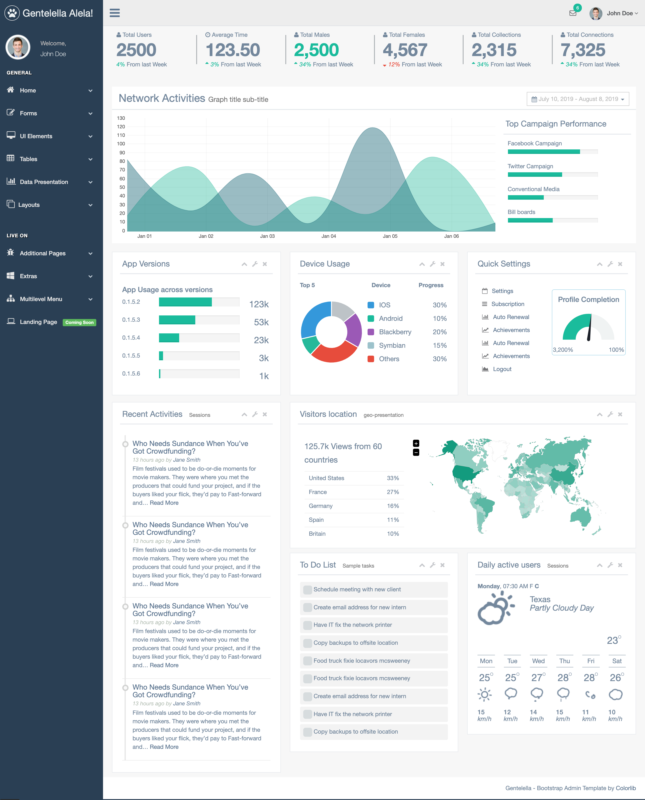
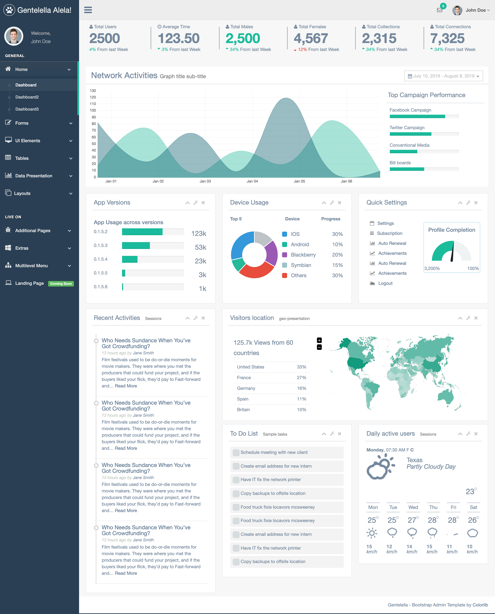
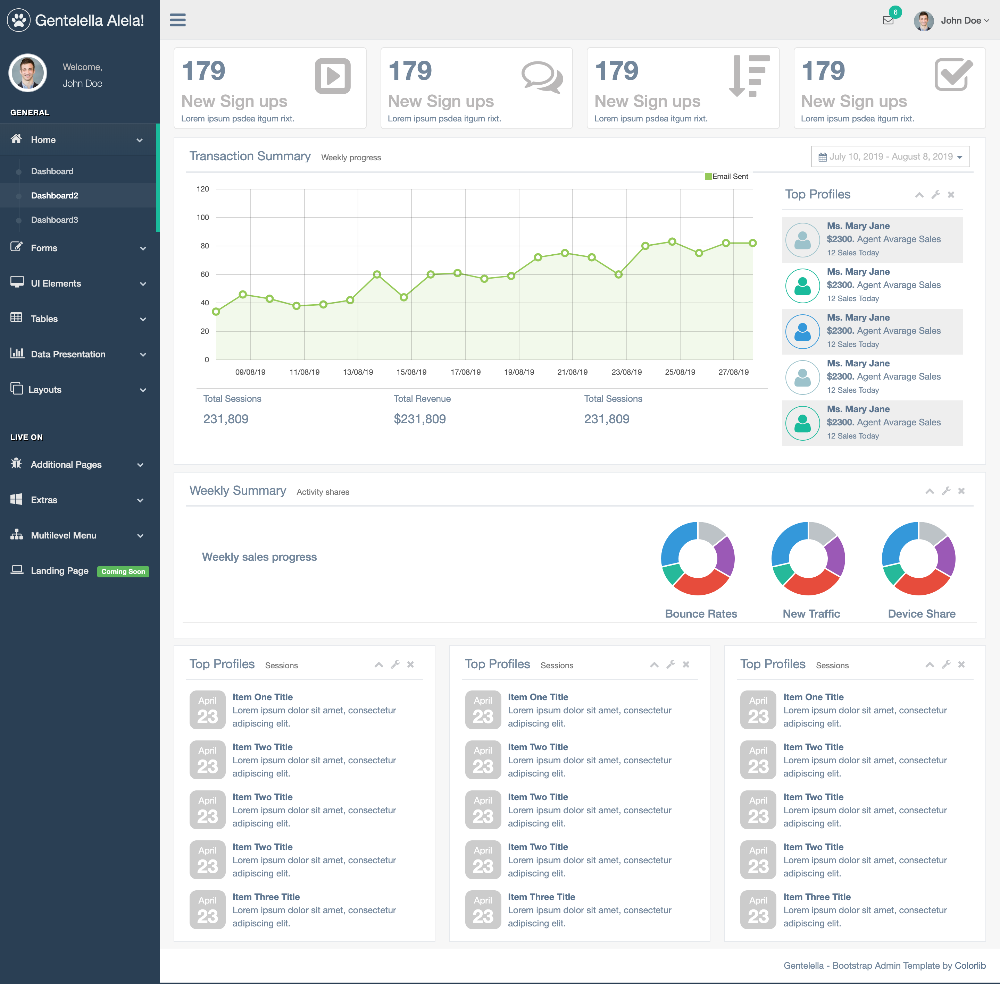
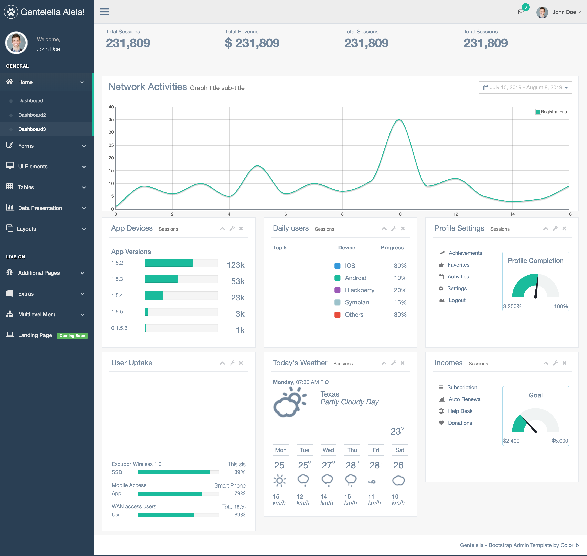
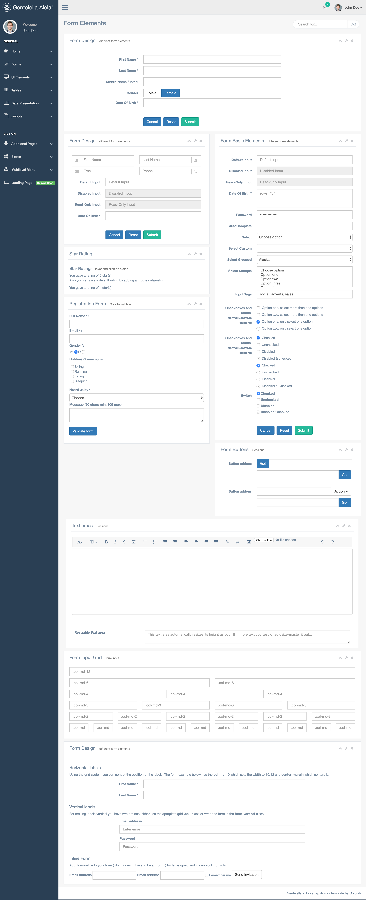
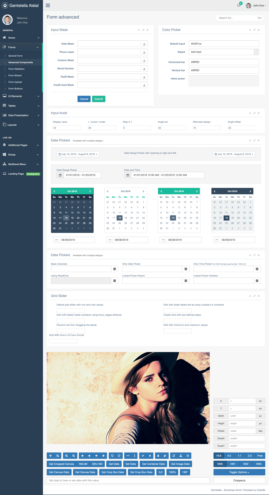

# spring-boot-gentelella-thymeleaf

Integrasi admin template https://github.com/puikinsh/gentelella dengan spring boot dan thymeleaf.

Untuk menjalankan di local, ketikkan:

`mvn clean spring-boot:run`

## Screen shot

Home

Index 1

Index 2

Index 3

General Form

Advanced Form

